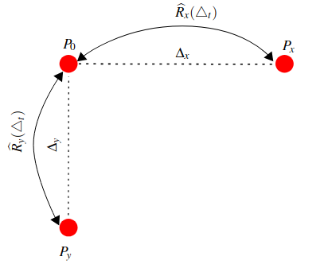
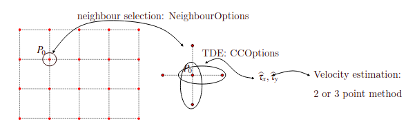

Velocity estimation
===================================

**velocity_estimation** is a Python library implementing the three-point velocity estimation technique described `here <https://doi.org/10.1063/5.0197251>`_.
This technique is tailored for coarse-grained imaging data, and has been applied to avalanche photodiode gass-puff imaging and synthetic data.

Other relevant repositories:

* `cmod functions <https://github.com/uit-cosmo/cmod_functions>`_: Gathering data from cmod tree, in xarray format.
* `blobmodel <https://github.com/uit-cosmo/blobmodel>`_: For generating 2D synthetic data.
* `xarray <https://github.com/pydata/xarray>`_: Manipulation of labelled multi-dimensional arrays.

Method description
--------

The mathematical background for the method is explained in detail in `the paper <https://doi.org/10.1063/5.0197251>`_.
The basic idea is that in order to estimate velocities in two-dimensions, a minimum of three measurement points (or pixels) is needed.

This sketch describes the setup of three measuring points :math:`P_0`, :math:`P_x` and :math:`P_y` used to estimate the velocity components. :math:`R_x(\Delta_t)` and :math:`R_y(\Delta_t)` denote the cross-correlation function between points :math:`P_0`
and :math:`P_x`, and between :math:`P_0` and :math:`P_y`, respectively. Maximization of these cross-correlation function yields time lags :math:`\tau_x` and :math:`\tau_y`, which are used to estimate the velocity components according to

.. math::
    \widehat{v} &= \frac{\Delta x \widehat{\tau_x}}{\widehat{\tau_x}^2 + \widehat{\tau_y}^2 \Delta x^2/\Delta y^2 } \\
    \widehat{w} &= \frac{\Delta y \widehat{\tau_y}}{\widehat{\tau_y}^2 + \widehat{\tau_x}^2 \Delta y^2/\Delta x^2}

In standard imaging data, where more than three pixels are available, there are several combinations of three pixels that can be made starting from a reference pixel :math:`P_0`: one can go right and down, as shown in the image, but also right and up, or left and down, etc. The code is configured to take all possible combinations of pixels (typically four, but only two on the edges, and one in the corners), then it computes the velocities for each of them assuming that the data from each pixel fulfills some data-quality requirements, and lastly the estimated velocity for that reference pixel is estimated as the average over all estimated velocities.
With this in mind, we can roughly divide the algorithm in the following steps:

1. For each pixel :math:`P` in the dataset:
2. Find all horizontal and vertical neighbours of :math:`P` satisfying some user-defined :ref:`velocity_estimation-neighbour_selection`.
3. For each combination of [:math:`P` + one horizontal neighbour + one vertical neighbour]:
    1. Estimate the time delays, :math:`\widehat{\tau}_x` and :math:`\widehat{\tau}_y`, between the signal measured at :math:`P` and each auxiliary points with some user-defined :ref:`EstimationOptions`.
    2. It the time delay estimation succeeds, estimate the velocity components following a user defined velocity estimation option.
4. Average over all successful velocity estimations and assign the resulting velocity to :math:`P`.

This and the relevant options are summarize in the next figure:

Each set of options is described in each section:

1. :ref:`velocity_estimation-estimation_options-neighbour`.
1. :ref:`velocity_estimation-estimation_options-cc`.
1. :ref:`velocity_estimation-estimation_options-ca`.
1. :ref:`velocity_estimation-estimation_options-ccf`.

Contents
--------

.. toctree::
    :caption: Contents
    :maxdepth: 1

    Installing <install>
    usage
    estimation_options
