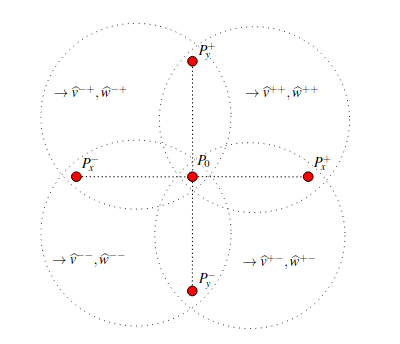

.. _velocity_estimation-neighbour_selection:

Neighbour Selection
===============

When estimating the velocity field at a pixel :math:`P_0` we localize the four nearest neighbors :math:`P_x^+`, :math:`P_x^-`, :math:`P_y^+` and :math:`P_y^-`.
Then each combination of horizontal and vertical neighbors will lead to a velocity estimate, indicated as :math:`\wh{v}^{++}`, :math:`\wh{w}^{++}`, etc.
The resulting velocity estimate is taken as an average of all found velocities.
Some differences may occur if the reference pixel :math:`P_0` is an edge or a corner pixel, in which case only two and one combination of pixels are available.

The selection based algorithm can be customized with the options `NeighbourOptions` are given in :ref:`NeighbourOptions`. Most importantly:
* `ccf_min_lag` is used to avoid using data when the maximum correlation time is comparable to the sampling time.
    Checks that the maximal correlation between adjacent pixels occurs at a time larger or equal than neighbors_ccf_min_lag multiples of the discretization
    time. If that's not the case, the next neighbor will be used, and so on until a
    neighbor pixel is found compliant to this condition. If set to 0, it only checks that
    the pixel is not dead.
*`min_separation` minimum allowed separation between pixels.
*`max_separation` maximum allowed separation between pixels. If some
    condition is required (such as ccf_min_lag) and not fulfilled for pixels closer
    or at than max_separation, then no neighbors will be used and the subset of pixels
    under process will yield no estimate. The condition applies on a closed interval,
    meaning that pixels separated exactly max_separation are allowed, thus setting
    min_separation = max_separation guarantees that the neighbour pixels will be separated
    by that distance.