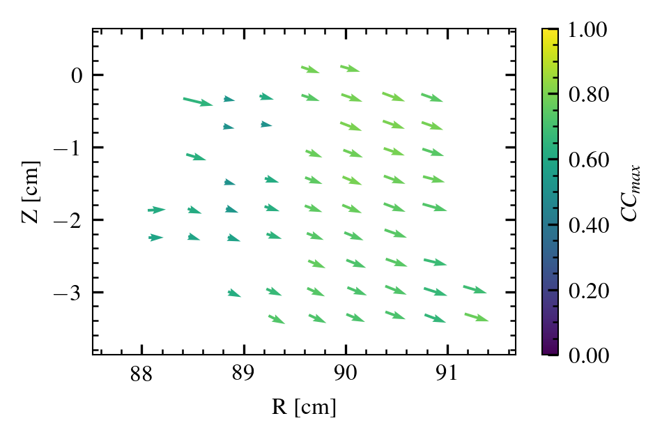

.. _velocity_estimation-usage:

Usage
===============

++++++++++++++++
Experimental data
++++++++++++++++

Retrieve data on xarray format with the functions from `cmod_functions <https://github.com/uit-cosmo/cmod_functions>`_.
Then load the data for example:

.. code-block:: python

    import xarray as xr

    path_to_data = ... # Change this to your path
    ds = xr.open_dataset(path_to_data)

Then ``estimate_velocity_field()`` will return a class containing estimated velocity data of all pixels. Different estimation parameters can be set with a ``EstimationOptions`` class, which is accepted as an arguments of ``estimate_velocity_field()``.
By default a cross-correlation technique is used to estimate time delays, but this can be changed by setting ``EstimationOptions.method``.

.. code-block::

    eo = tdve.EstimationOptions()
    print(eo.method)

This will print ``TDEMethod.CC``, indicating that a cross-correlation method (CC) is being employed.
In addition to the own parameters in the ``EstimationOptions`` class, further time delay estimation options are specified in ``EstimationOptions.cc_options``, ``EstimationOptions.cca_options`` and ``EstimationOptions.ccf_options``. If you use cross-correlation time-delay estimation method (by setting ``method=TDEMethod.CC``), you only need to specify ``EstimationOptions.cc_options``, and likewise for the other methods.

.. code-block::

    print(eo.cc_options)

With output ``CC Window: None, Minimum CC Value: 0.5, Running Mean: True, Running Mean Window Max: 7, Interpolate: False``.

Check out the documentation of the option class for the time delay estimation method you plan to use to get an overview of the parameters. All parameters have default values, but most likely you will want to set some of these by your own.

Some important options are:

* ``eo.use_3point_method`` If False, use 2 point method to estimate velocities from time delays.
* ``eo.cc_options.cc_window`` Size of the window of time lags considered for the cross-correlation function.
* ``eo.cc_options.interpolate`` Should interpolate ccf to find the maximum (if set to False, the time delays are restricted to integer multiples of the sampling time).

Estimate velocities by:

.. code-block::

    movie_data = tdve.estimate_velocity_field(u.CModImagingDataInterface(ds), eo)
    vx = movie_data.get_vx()
    vy = movie_data.get_vy()
    confidences = movie_data.get_confidences()
    R = movie_data.get_R()
    Z = movie_data.get_Z()

These contain the estimated velocities components for each pixel together with the confidence of the estimation (a measure of uncertainty). The velocity field can be plotted with standard plotting libraries:

.. code-block::

    axes_size = cosmoplots.set_rcparams_dynamo(plt.rcParams, num_cols=1, ls="thin")
    plt.rcParams["mathtext.fontset"] = "custom"

    fig = plt.figure()
    ax = fig.add_axes(axes_size)
    norm = mpl.colors.Normalize(vmin=0, vmax=1)
    qiv = ax.quiver(
        R,
        Z,
        vx,
        vy,
        confidences,
        scale=210000,   # Scale arrows
        scale_units="xy",
        angles="xy",
        norm=norm,
    )
    cbar = fig.colorbar(qiv, format="%.2f")
    cbar.ax.set_ylabel(r"$CC_{max} $")
    ax.set_xlabel("R [cm]")
    ax.set_ylabel("Z [cm]")
    ax.set_ylim(np.min(Z) - 0.5, np.max(Z) + 0.5)
    ax.set_xlim([np.min(R) - 0.5, np.max(R) + 0.5])
    plt.show()

